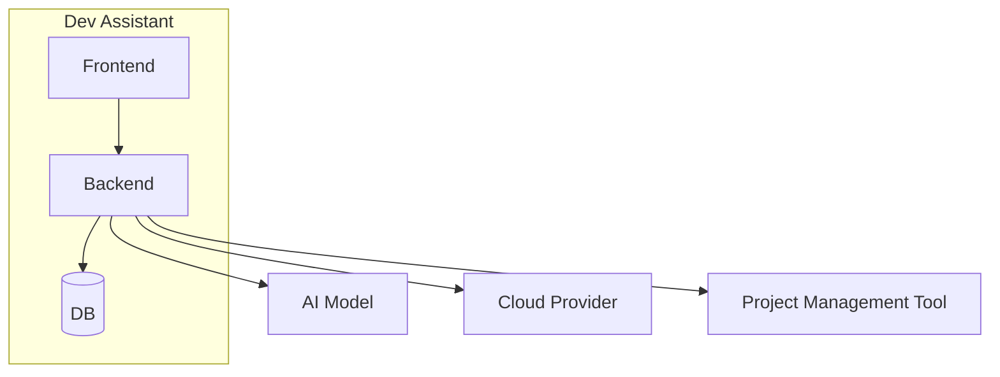

In the next diagram we can see the main components of the Dev Assistant App

```mermaid
graph TD;
    subgraph Dev Assistant
        A[Frontend] --> B[Backend];
        B[Backend] --> C[(DB)];
    end
    B[Backend] --> D[AI Model];
    B[Backend] --> E[Cloud Provider];
    B[Backend] --> F[Project Management Tool];
```