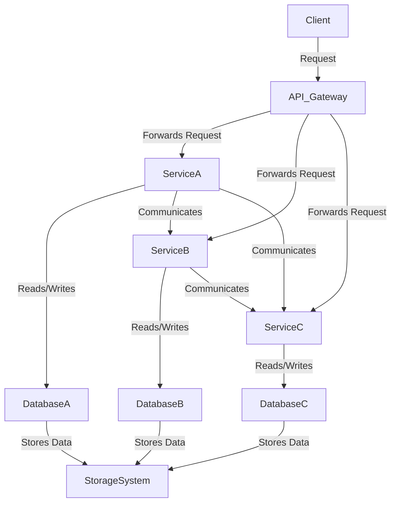

Here is an example of service Based architecture

```mermaid
graph TD;
    Client -->|Request| API_Gateway;
    API_Gateway -->|Forwards Request| ServiceA;
    API_Gateway -->|Forwards Request| ServiceB;
    API_Gateway -->|Forwards Request| ServiceC;

    ServiceA -->|Reads/Writes| DatabaseA;
    ServiceB -->|Reads/Writes| DatabaseB;
    ServiceC -->|Reads/Writes| DatabaseC;

    ServiceA -->|Communicates| ServiceB;
    ServiceA -->|Communicates| ServiceC;
    ServiceB -->|Communicates| ServiceC;

    DatabaseA -->|Stores Data| StorageSystem;
    DatabaseB -->|Stores Data| StorageSystem;
    DatabaseC -->|Stores Data| StorageSystem;

```